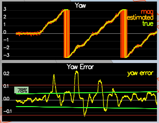
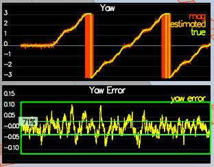

# Estimation Project #

Miguel Campo

macamporem@gmail.com | 6036673655

### Step 1: Sensor Noise ###

1. **Process the logged files to figure out the standard deviation of the the GPS X signal and the IMU Accelerometer X signal.**

   The standard deviation of the GPS-measured XY coordinates is approx. 0.73.

   The standard deviation of the IMU-measured XY acceleration is approx. 0.51.

   

2. **Run the simulator. If your values are correct, the dashed lines in the simulation will eventually turn green, indicating you’re capturing approx 68% of the respective measurements (which is what we expect within +/- 1 sigma bound for a Gaussian noise model)**

### Step 2: Attitude Estimation ###

1. **In `QuadEstimatorEKF.cpp`, you will see the function `UpdateFromIMU()` contains a complementary filter-type attitude filter.  To reduce the errors in the estimated attitude (Euler Angles), implement a better rate gyro attitude integration scheme.  You should be able to reduce the attitude errors to get within 0.1 rad for each of the Euler angles.** 

We are asked to improve the complementary filter-type attitude filter.  In the given implementation, the code uses a small-angle approximation by which the integrated (<u>predicted</u>) value of roll and pitch is later on updated in a complementary filter style with attitude <u>measurement</u> from accelerometers.  Under the small-angle approximation, the assumption is that that the angular velocity (which is in body frame) can be used directly as angular rotation in the inertial frame, which results in the following equations

​	predictedPitch = pitchEst + dtIMU \* gyro.y

​	float predictedRoll = rollEst + dtIMU \* gyro.x

​	ekfState(6) = ekfState(6) + dtIMU \* gyro.z

Instead, we are asked to implement a better integration (<u>prediction</u>) method that uses the current attitude estimate (rollEst, pitchEst and ekfState(6)) to integrate the body rates into new Euler angles.  One way to do this is to create a rotation matrix based on the current Euler angles, and use the rotation matrix to transform body rates to convert to angular rotation.  Specifically, the inverse transformation from body rates to Euler-angle rates using current Euler angles is given by:

After implementing the improved nonlinear scheme, the error is within 0.1 rad for each of the Euler angles for at least 3 seconds.

### Step 3: Prediction Step ###

**In this next step you will be implementing the prediction step of your filter.**

1. **In `QuadEstimatorEKF.cpp`, implement the state prediction step in the `PredictState()` functon.** 

 The acceleration vector passed to the function is given in the body frame.  

The transform (<u>predict</u>) function is given by the equation:

The second term transforms body-frame accelerations to inertial frame by  rotating using current attitude.  This is done by the simple expression

​	attitude.Rotate_BtoI(accel)

Finally, since the yaw integral is already done in the IMU update it doesn't need to be integrated as part of PredictState().

After the update, the estimated and actual states match.  However, we can also see drift over time in the position estimates.

3. **Now let's introduce a realistic IMU, one with noise.  Run scenario `09_PredictionCov`. In `QuadEstimatorEKF.cpp`, calculate the partial derivative of the body-to-global rotation matrix in the function `GetRbgPrime()`.**  

The rotation matrix from body to global is given by

The jacobian of the rotation matrix from body to global is given by

3. **Once you have that function implement, implement the rest of the prediction step (predict the state covariance forward) in `Predict()`.**

The prediction covariance forward is a function of the transition Jacobian (G) and the prediction covariance (C)

The transition Jacobian is given by

5. **Run your covariance prediction and tune the `QPosXYStd` and the `QVelXYStd` process parameters in `QuadEstimatorEKF.txt` to try to capture the magnitude of the error you see.** 

Before adjustment

After adjustment

QPosXYStd = 0.05

QVelXYStd = 0.1#.05

### Step 4: Magnetometer Update ###

1. **Tune the parameter `QYawStd` (`QuadEstimatorEKF.txt`) for the QuadEstimatorEKF so that it approximately captures the magnitude of the drift.**

QYawStd = .01

3. Implement magnetometer update in the function `UpdateFromMag()`.  

After implementing tye yaw update, the estimated standard deviation is

QYawStd = .1

the estimated standard deviation accurately captures the error.  Moreover, the error is less than 0.1rad in heading for at least 10 seconds of the simulation.

Note that the estimated standard deviation after the update is smaller than before the update.  Hpw could this be?

The reason has to do with the the difference in the nature of the stochastic yaw error process.  

- before yaw update, the yaw error process displays large swings.
- after the yaw update, the yaw process is mean-reverting normally distributed.

### Step 5: Closed Loop + GPS Update ###

1. **Tune the process noise model in `QuadEstimatorEKF.txt` to try to approximately capture the error you see with the estimated uncertainty (standard deviation) of the filter.**

4. **Implement the EKF GPS Update in the function `UpdateFromGPS()`.**

After implementing EKF GPS Update and tuning the GPS update parameters process noise to

GPSPosXYStd = 1.5

GPSPosZStd = 2.5 #more difficult to measure

GPSVelXYStd = .1

GPSVelZStd = .3

the quad is able complete the entire simulation cycle with estimated position error of < 1m 

### Step 6: Adding Your Controller ###

1. **Replace `QuadController.cpp` with the controller you wrote in the last project.**
2. **Replace `QuadControlParams.txt` with the control parameters you came up with in the last project.**
3. **Run scenario `11_GPSUpdate`.** 

Upon replacing the files with the new control code and parameters, the quad is able to once again complete the entire simulation cycle with an estimated position error of < 1m without any additional parameter tuning of the controller.

## Submission ##

For this project, you will need to submit:

 - a completed estimator that meets the performance criteria for each of the steps by submitting:
   - `QuadEstimatorEKF.cpp`
   - `config/QuadEstimatorEKF.txt`

 - a re-tuned controller that, in conjunction with your tuned estimator, is capable of meeting the criteria laid out in Step 6 by submitting:
   - `QuadController.cpp`
   - `config/QuadControlParams.txt`

 - a write up addressing all the points of the rubric

